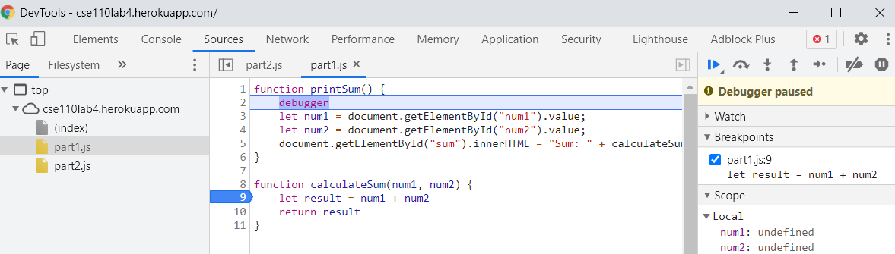
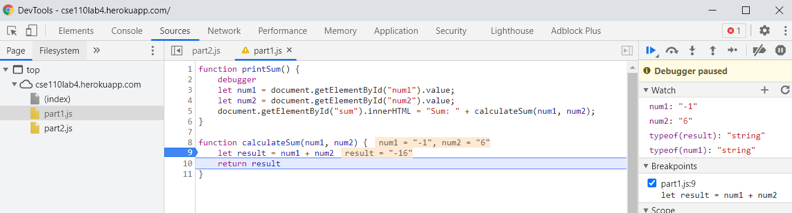
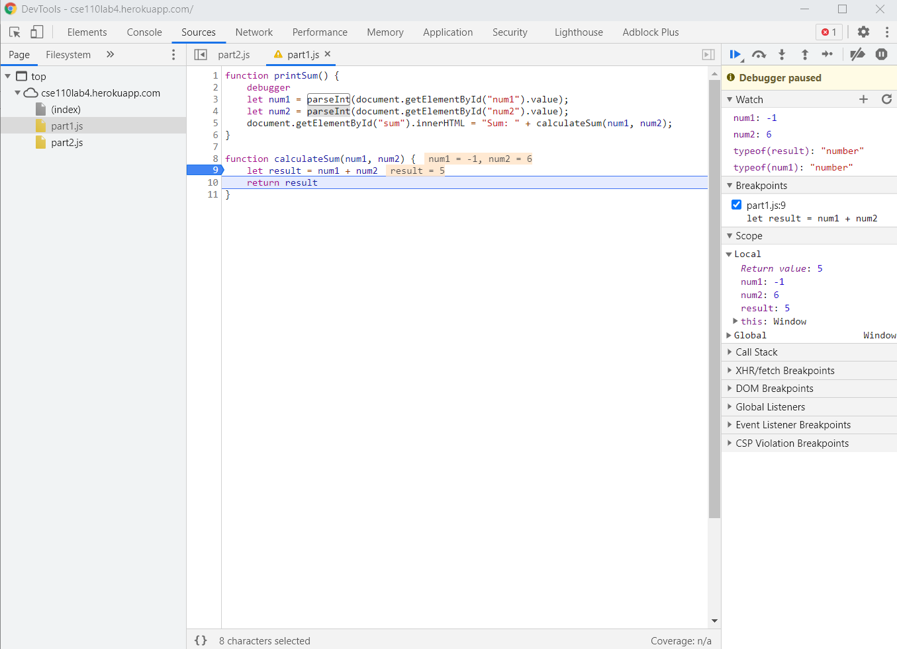

## Part 3
### Debugging

1. The bug was that `num1` and `num2` were stored as type string, not their numeric representation, so adding them to evaluate `result` would just concatenate the strings.
2. The most straightforward fix would be to just use `parseInt()` on `num1` and `num2` to convert their types to 'number' and thus adding to evaluate `result` would do numeric addition. 

### Network Tab
3. Name: 'citylots.json'
4. Initiated fetch by file 'part2.js'
5. File size: 11687628 bytes (~11.7 MB)
6. Content download took 75.24ms.
7. Mozilla/5.0 (Windows NT 10.0; Win64; x64) AppleWebKit/537.36 (KHTML, like Gecko) Chrome/90.0.4430.85 Safari/537.36
8. Came from Apache Server
9. Last Modified: Tue, 26 Jan 2021 22:14:13 GMT
10. Content type: application/json
11. `fetchData` made the request inside 'part2.js'